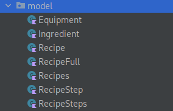
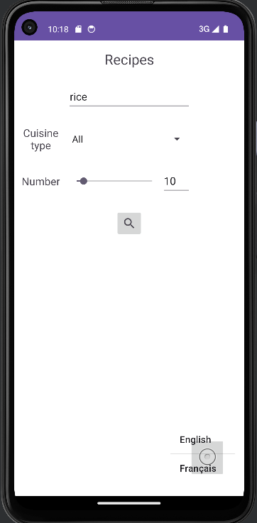
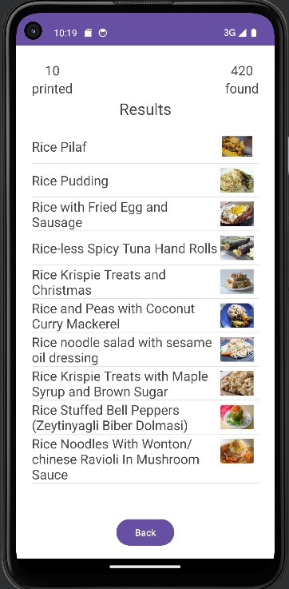
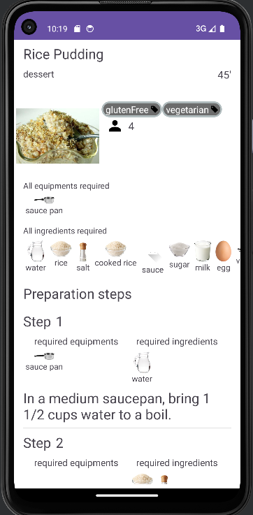

# Sommaire

1. [Présentation](#présentation)
   - [Membres du groupe](#membres-du-groupe)
   - [Description](#description)
2. [Rapport technique](#rapport-technique)
   - [Le modèle](#le-modèle)
   - [Les activités](#les-activités)
     - [MainActivity](#mainactivity)
     - [ResultActivity](#resultactivity)
     - [DetailActivity](#detailactivity)
3. [Roadmap](#roadmap)
4. [Historique](#historique)

# Présentation

## Membres du groupe

- David CHOCHO (chef de projet)
- Ibrahim AHAMADA
- Tom FREMONT
- Bastian MARY
- Nils MOREAU--THOMAS

## Description
Dans le cadre de la SAE du Semestre 4 (2ème semestre de BUT2)
nous devions créer une application mobile à l'aide d'Android studio
consistant à exploiter l'api Spoonacular API pour recupérer des recettes
de cuisines et peupler notre application

# Rapport technique

## Le modèle

Dans notre modèle nous avons 3 grosses classe : 

- __Ingredient__ qui représente un ingrédiant avec son et son image notamment

- __Equipement__ qui représente un equipement avec les même champs que ingrédiant

- __Recipe__ et ses variations qui representent toutes une ou plsieurs recettes dans leurs différents formats

## Les activités

### MainActivity

Dans cette Activité nous avons 5 fonctionnalités :

- le champ de texte tout en haut sert a écrire le chaine qui servira de requete pour rechercher des plats (en anglais)

- le type de cuisine qui est une liste déroulante qui sert a filtrer ou pas le type de cuisine désiré

- le nombre de résultats souhaité (de 1 à 100) pouvant être changé grâce à la scrollbar ou le champ de texte 

- le bouton rechercher qui lance la recherche avec les critères précedemment spécifiés et affiche le résultat dans __ResultActivity__

- le bouton langue permettant de changer la langue en direct de tout les champs de notre application entre français et anglais ( /!\ les valeurs de l'api ne sont pas traduits)

### ResultActivity

Dans cette Activité nous avons 3 fonctionnaliés : 

- L'affichage du nombre de résultats trouvés et affichés

- L'affichage dans une liste personnalisée des résultats

- Le clic sur un résultat affiche les infos détaillés sur la recette dans __DetailActivity__

### DetailActivity

Dans cette activité nous avons de multiples affichages comme l'affichage du type de cuisine de la recette, des tags ou les equipements/ingredients nécessaires pour la recette et pour chaque étape.

# Roadmap
version actuelle : v1.1.2   

cette roadmap permet d'avoir une trace de nos projections et
projets d'améliorations pour notre application sur le temps

## pour la v1.2

- mode nuit
- recherche complexe
- tags clickables

# Historique

Cette historique nous permet de garder une trace de notre avancement
tout au long du projet en sachant que les versions ici décrites sont
effectifs
(c'est-à-dire que notre application mobile a été réellement versionné et de plus de cette manière)

## v1.1.3

- changement du nom officiel
- liste equipements/ingrediants totaux pour le détail des recettes
- traduction de la liste des choix de la cuisines pour la recherche
- résolution du bug de changement de langue

## v1.1.2

- ajout du choix de la langue (français,anglais)
- gestion des locales (français,anglais)

## v1.1

-
